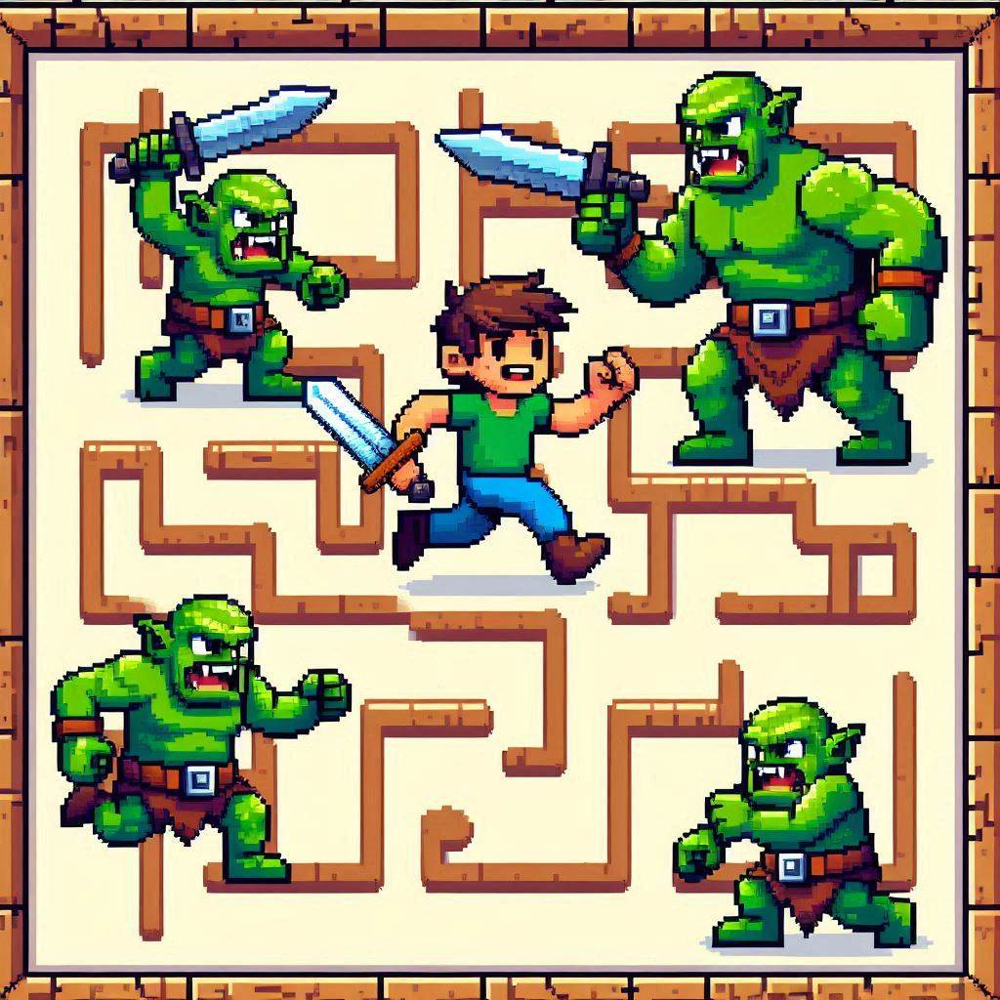

# Wandertrap

Welcome to "Wandertrap," a 2D platform game where you navigate through a labyrinth filled with puzzles, traps, and mythical creatures.

*Help Theo the Wizard navigate through the Wandertrap and find the exit in each level*



## Overview

Wandertrap is an exciting 2D platform game that challenges players to navigate through intricate labyrinths filled with puzzles, traps, and mythical creatures. As you progress through the levels, you'll encounter various obstacles, collect power-ups, and face off against cunning guards. Your goal is to find the exit in each level while maximizing your score and preserving your lives.

### Key Features

- Engaging 2D platformer gameplay
- Multiple levels with increasing difficulty
- Various entities including player, guards, explosives, and power-ups
- Pixel art graphics for a retro gaming feel
- Score tracking and high score system
- Responsive controls for smooth navigation

Embark on this thrilling adventure and see if you can outsmart the Wandertrap!

## Documentation

- [Story of Wandertrap](docs/story.md)
- [Entity Overview](docs/entities.md)
- [Levels Overview](docs/levels.md)

## Project Structure

The project is organized into several directories and files, each serving a specific purpose:

- **game/**: Contains the main game logic, assets, screens, levels, and utility functions.
  - **game.js**: Main game logic, including initializing the game board, handling player input, updating game state, and rendering the game board and entities.
  - **assets.js**: Handles loading game assets.
  - **screens/**: Contains different screen modules like welcome screen, game over screen, high score screen, and level completed screen.
  - **levels/**: Contains level-specific configurations and data.
  - **utils/**: Contains utility functions and settings for the game, including theme, date, and canvas utilities.
- **index.html**: The main HTML file that sets up the game container and includes the game script.

## Installation and Running

To get started with `Wandertrap`, follow these steps:

1. Clone the repository to your local machine.

2. Make sure you have [Node.js](https://nodejs.org/) installed on your system.

3. Open a terminal and navigate to the project directory.

4. Install the project dependencies by running:

   ```bash
   npm install
   ```

5. To start the development server and run the game, use:

   ```bash
   npm start
   ```

   This will start the Parcel bundler and serve the game at `http://localhost:1234` (or another port if 1234 is in use).

6. To build the project for production, run:

   ```bash
   npm run build
   ```

   This will create a `dist` folder with the optimized and bundled files ready for deployment.

Note: The game uses Parcel as its bundler, which is included in the dev dependencies and will be installed automatically when you run `npm install`.
