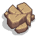

# Entity Overview

This document provides an overview of the entities in "Wandertrap" and the letters that represent them in the game layout.

## Entities and Their Representations

- **Player (P)**
  - Can move left, right, up, and down.
  - Can attack guards, and collect powerups, explosives, and keys.

- **Guard (G)**
  - Can move towards the player and detect the player's position.
  - Can attack the player and be defeated by the player.
  - Can drop powerups, explosives, and keys when defeated.



- **Obstacle (O)**
  - Can be destroyed by the player.
  - Can drop powerups, explosives, and keys when destroyed.

- **Powerup (U)**
  - Can be collected by the player.
  - Can be dropped by guards, obstacles, and keys.

- **Explosive (E)**
  - Can be hidden under obstacles and activates when the player is near.
  - Can reduce player lives and create visual effects when detonated.

- **Key (K)**
  - Can be collected by the player.
  - Can be dropped by guards and obstacles.

- **Wall (#)**
  - Cannot be destroyed by the player.

- **Exit (X)**
  - Represents the exit in the game.
  - Can be collected by the player.

## Example Level Layout

Here is an example of a level layout with the entities represented by their respective letters:

```javascript
[
    ['#', '#', '#', '#', '#', '#', '#', '#'],
    ['#', 'P', ' ', ' ', ' ', ' ', ' ', '#'],
    ['#', 'O', '#', ' ', '#', ' ', ' ', '#'],
    ['#', ' ', '#', ' ', '#', ' ', ' ', '#'],
    ['#', 'E', ' ', ' ', ' ', ' ', ' ', '#'],
    ['#', ' ', '#', ' ', '#', ' ', ' ', '#'],
    ['#', ' ', ' ', 'G', ' ', 'E', ' ', 'X'],
    ['#', '#', '#', '#', '#', '#', '#', '#']
]
```

## Note

The current way of level design leaves not a lot of room for customization. We have different powerups, different kinds of obstacles, and other entities that could be utilized to create more varied and interesting levels. Consider expanding the level design to incorporate these elements more effectively.
The current approach is very rigid and doesn't allow for much creativity in level design. It was designed to be simple and easy to understand, but it may not be the best way to create a game with a lot of levels and different scenarios.
